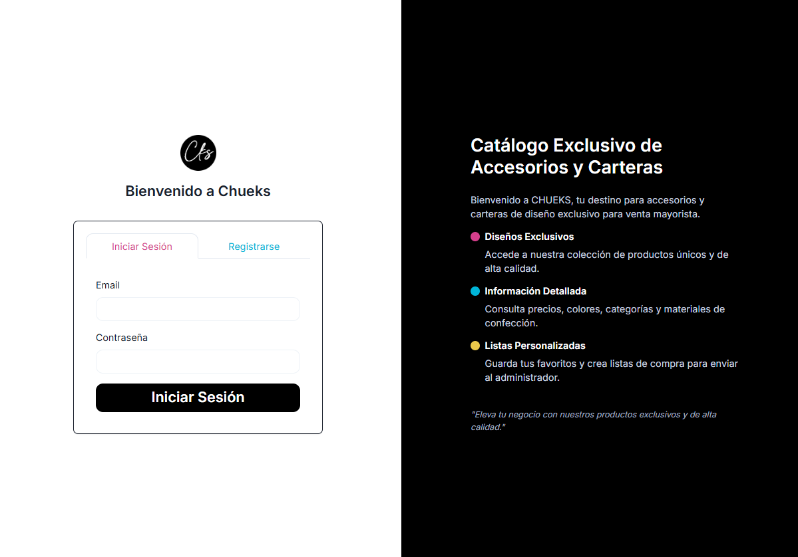

# 🛍️ Chueks Frontend

**Chueks** es una aplicación web de e-commerce moderna desarrollada con **React + Vite**, que permite a los usuarios registrarse, iniciar sesión, gestionar su perfil, direcciones, teléfonos, favoritos y realizar pedidos.  
Está conectada al backend desplegado en **Vercel**, construido con **Node.js, Express y MongoDB**.

### 📌 Login



🌐 **Demo en producción:**  
👉 [https://chueks-frontend.vercel.app/auth](https://chueks-frontend.vercel.app/auth)

📦 **Repositorio Backend:**  
👉 [https://github.com/Nannita1403/Chueks_Backend](https://github.com/Nannita1403/Chueks_Backend)  
🔗 **Backend en producción:**  
👉 [https://chueks-backend.vercel.app/](https://chueks-backend.vercel.app/)

---

## 🚀 Tecnologías principales

- ⚛️ **React + Vite** — Framework moderno y rápido para SPA.
- 💅 **Chakra UI** — Librería de componentes accesibles y personalizables.
- 🔄 **Context API** — Manejo global del estado de autenticación.
- 📡 **Axios / ApiService** — Peticiones HTTP al backend.
- 🍞 **Custom Hooks** — `useToast`, `useAuth`, etc.
- 🧩 **React Router DOM** — Navegación entre rutas protegidas y públicas.
- 🪄 **ShadCN + Lucide Icons** (en proceso) — Mejora estética y usabilidad.

---

## 🧱 Estructura del proyecto

```
chueks_frontend/
│
├── src/
│   ├── components/          # Componentes reutilizables (modales, formularios, etc.)
│   ├── context/             # Contextos globales (Auth)
│   ├── Hooks/               # Custom hooks (useToast, etc.)
│   ├── pages/               # Páginas principales del sitio
│   │   ├── Auth/            # Login, registro, verificación
│   │   ├── Profile/         # Dashboard de usuario (direcciones, teléfonos, pedidos)
│   │   ├── Shop/            # Catálogo de productos
│   │   └── Home/            # Página principal
│   ├── reducers/api/        # Configuración de API y endpoints
│   ├── assets/              # Imágenes y recursos estáticos
│   ├── App.jsx              # Rutas principales
│   ├── main.jsx             # Punto de entrada de la app
│   └── index.css            # Estilos globales
│
├── .env.example             # Variables de entorno de ejemplo
├── package.json
├── vite.config.js
└── README.md
```

---

## ⚙️ Instalación local

Clona el proyecto y ejecuta los siguientes comandos:

```bash
# Clonar el repositorio
git clone https://github.com/Nannita1403/chueks_frontend.git

# Entrar al directorio
cd chueks_frontend

# Instalar dependencias
npm install

# Crear archivo de entorno
cp .env.example .env
```

### 🧩 Variables de entorno necesarias

En tu archivo `.env`, agrega la URL base del backend:

```env
VITE_API_URL=https://chueks-backend.vercel.app
```

---

## 🧑‍💻 Ejecución en desarrollo

```bash
npm run dev
```
El proyecto se abrirá en `http://localhost:5173`

---

## 🧱 Build para producción

```bash
npm run build
npm run preview
```

---

## 🔐 Autenticación

El sistema de login y registro se conecta con el backend de **Chueks**, validando correos y contraseñas.  
Se guarda el **token JWT** en el `localStorage`, y se maneja el usuario logueado mediante `AuthContext`.

---

## 📬 Funcionalidades principales

- **Registro y login** con validación por correo electrónico.  
- **Gestión de perfil**: editar nombre, direcciones y teléfonos.  
- **Pedidos del usuario** con estado (`pendiente`, `pagado`, `enviado`, `cancelado`).  
- **Gestión de favoritos** (wishlist).  
- **Toasts y feedback visual** para todas las acciones.  
- **Rutas protegidas** según estado de autenticación.  

---

## 🗺️ Rutas de la aplicación

La aplicación cuenta con rutas públicas y rutas protegidas que requieren autenticación mediante JWT. Algunas también requieren rol de administrador.

### 🔓 Rutas públicas

| Ruta         | Componente   | Descripción                         |
|--------------|--------------|-------------------------------------|
| `/auth`      | `AuthPage`   | Página de inicio de sesión y registro. |

---

### 🔐 Rutas protegidas (usuario)

> Estas rutas requieren que el usuario esté autenticado (`ProtectedRoute`).

| Ruta                   | Componente            | Descripción                                      |
|------------------------|-----------------------|--------------------------------------------------|
| `/home`                | `Home`                | Página principal del usuario.                   |
| `/product/:id`         | `ProductDetail`       | Vista detallada de un producto.                 |
| `/products`            | `CategoryPage`        | Catálogo general de productos.                  |
| `/category/:id`        | `CategoryPage`        | Productos filtrados por categoría.              |
| `/wishlist`            | `Wishlist`            | Lista de favoritos del usuario.                 |
| `/cart`                | `Cart`                | Carrito de compras.                             |
| `/order/confirm`       | `OrderConfirm`        | Confirmación de un pedido exitoso.              |

#### 📁 Sub-rutas dentro de `/profile`

> Envoltura: `UserLayout`  
Estas rutas también están protegidas y pertenecen al perfil del usuario.

| Ruta                   | Componente            | Descripción                                      |
|------------------------|-----------------------|--------------------------------------------------|
| `/profile`             | `ProfileDashboard`    | Panel de información personal.                   |
| `/profile/orders`      | `OrdersPageUser`      | Historial de pedidos del usuario.                |

---

### 🛠️ Rutas protegidas (administrador)

> Estas rutas requieren autenticación y privilegios de administrador (`ProtectedRoute adminOnly`).  
> Están agrupadas dentro del layout de administración (`AdminLayout`).

| Ruta                       | Componente           | Descripción                                     |
|----------------------------|----------------------|-------------------------------------------------|
| `/admin`                  | `AdminDashboard`     | Panel principal del administrador.              |
| `/admin/products`         | `AdminProducts`      | Gestión de productos (CRUD).                    |
| `/admin/categories`       | `AdminCategories`    | Gestión de categorías de productos.             |
| `/admin/analytics`        | `AnalyticsPage`      | Análisis y métricas de ventas.                  |
| `/admin/orders`           | `AdminOrders`        | Gestión de pedidos realizados.                  |

---

### 🚧 Redirecciones

| Ruta       | Acción                                    |
|------------|-------------------------------------------|
| `/`        | Redirecciona automáticamente a `/home`.   |


## 🧑‍🎨 Diseño

- UI consistente gracias a **Chakra UI**.
- Componentes modales y formularios personalizados.
- Diseño **responsive** para escritorio y móvil.

---

## 🚀 Despliegue

La app está desplegada en **Vercel**:  
🔗 [https://chueks-frontend.vercel.app](https://chueks-frontend.vercel.app)

Para desplegar tu propia versión:

1. Crea una cuenta en [vercel.com](https://vercel.com).
2. Conecta tu repositorio de GitHub.
3. Configura la variable de entorno `VITE_API_URL`.
4. Vercel detectará automáticamente el framework **Vite + React**.

---

## 🧩 Conexión con el backend

La aplicación se conecta a la API alojada en:

```
https://chueks-backend.vercel.app/
```

Endpoints usados:

| Función              | Método | Endpoint                    |
|----------------------|---------|------------------------------|
| Registro             | POST    | `/users/register`           |
| Login                | POST    | `/users/login`              |
| Obtener perfil       | GET     | `/users/checksession`       |
| Actualizar perfil    | PATCH   | `/users/update`             |
| CRUD Direcciones     | POST/PUT/DELETE | `/users/addresses/:id` |
| CRUD Teléfonos       | POST/PUT/DELETE | `/users/phones/:id`    |
| Obtener pedidos      | GET     | `/orders/my-orders`         |

---

## 🧑‍💻 Autor

Desarrollado por **[Nannita1403](https://github.com/Nannita1403)** 💜  
Con cariño y dedicación para el proyecto **Chueks** 🛒

---

